# Give Me Some Credit: отчет по разработке модели

## 1. Постановка задачи

Цель: предсказать вероятность серьезной просрочки по кредиту в горизонте 2 лет (`SeriousDlqin2yrs`).

Важно: в исходном датасете отсутствует явная временная метка. Для построения псевдо-`OOT` использован порядок строк: первые `120000` наблюдений попали в development, последние `30000` наблюдений — в `OOT`. Это техническое приближение, а не полноценная временная валидация.

## 2. Данные

- Train shape: `(150000, 12)`
- External test shape: `(101503, 12)`
- Target rate (train): `6.68%`
- Доля development: `80.00%`
- Доля OOT: `20.00%`

### Пропуски

| feature                              |   missing_share |
|:-------------------------------------|----------------:|
| MonthlyIncome                        |          0.1982 |
| NumberOfDependents                   |          0.0262 |
| Unnamed: 0                           |          0      |
| SeriousDlqin2yrs                     |          0      |
| RevolvingUtilizationOfUnsecuredLines |          0      |
| age                                  |          0      |
| NumberOfTime30-59DaysPastDueNotWorse |          0      |
| DebtRatio                            |          0      |
| NumberOfOpenCreditLinesAndLoans      |          0      |
| NumberOfTimes90DaysLate              |          0      |
| NumberRealEstateLoansOrLines         |          0      |
| NumberOfTime60-89DaysPastDueNotWorse |          0      |

## 3. EDA

### Основные наблюдения

- Доля дефолтов в train составляет `6.68%`, что указывает на выраженный дисбаланс классов.
- Основные пропуски сосредоточены в `MonthlyIncome` (`19.82%`) и `NumberOfDependents` (`2.62%`).
- Возрастная структура умеренно широкая: среднее `52.3`, медиана `52.0`, диапазон `0`-`109`.
- Признаки delinquency, `DebtRatio`, `MonthlyIncome` и utilization имеют тяжелые хвосты, поэтому в EDA добавлен отдельный анализ выбросов.
- Для сравнения распределений до и после обработки строятся boxplot'ы и гистограммы после winsorization по 1/99 процентилям.

### Общие графики

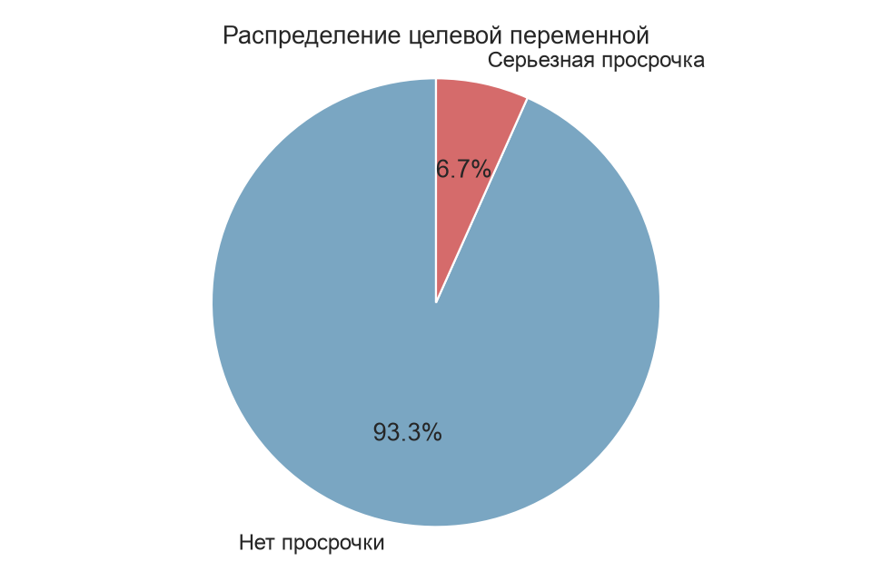
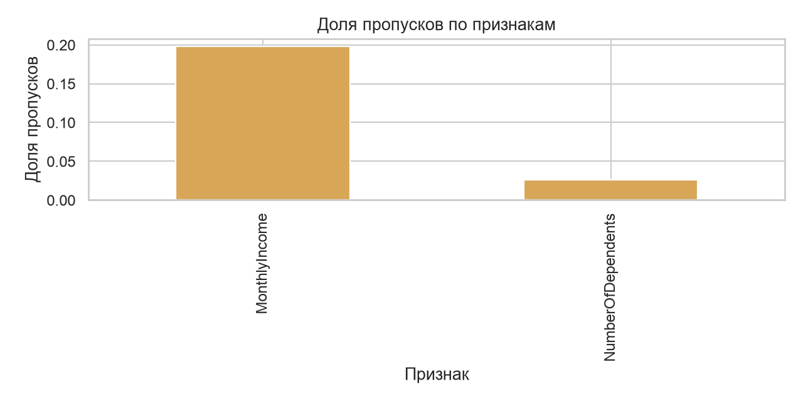
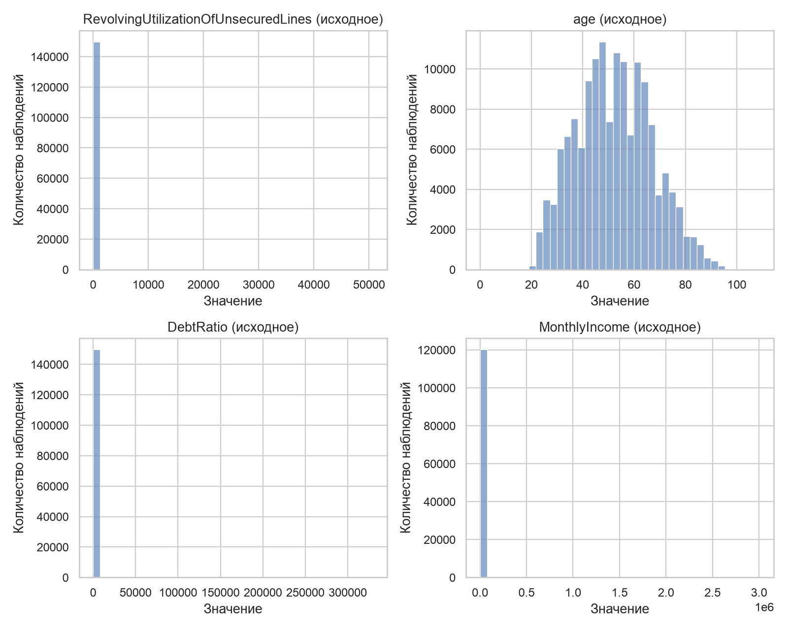
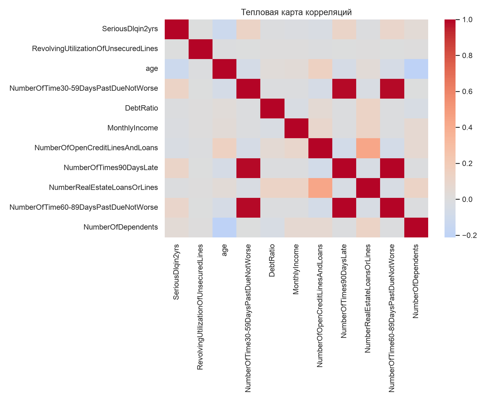

### Анализ выбросов

График boxplot показывает, в каких числовых признаках есть тяжелые хвосты, экстремальные значения и потенциальные выбросы, которые могут искажать обучение модели.

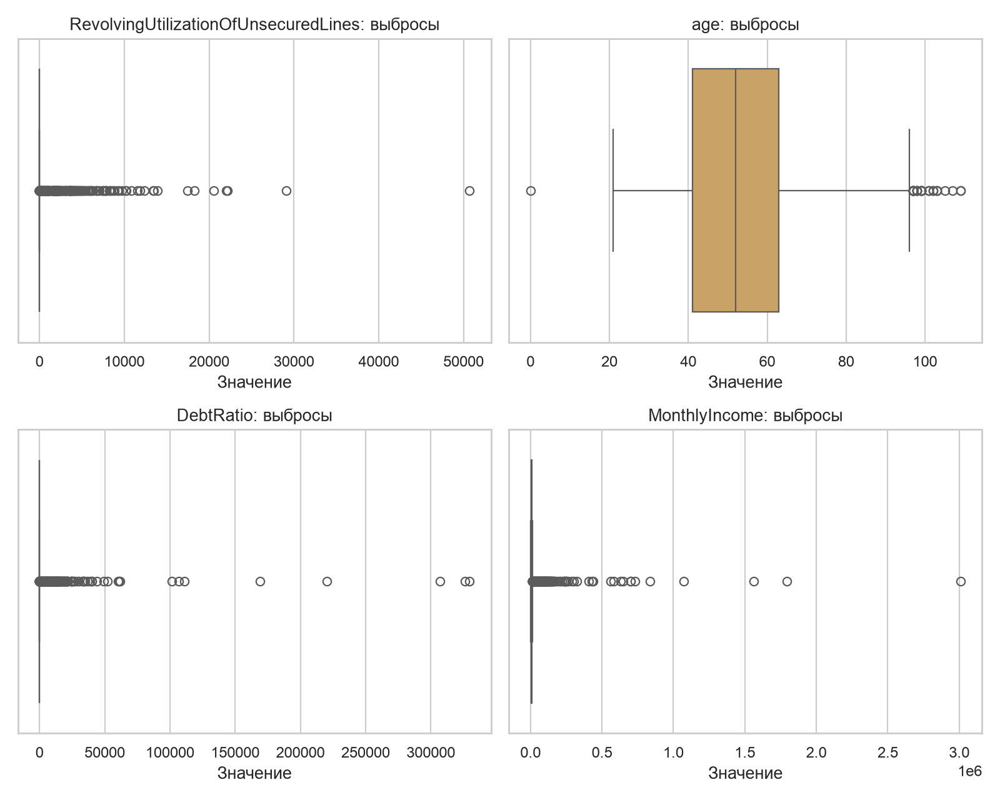

### Анализ без выбросов

Гистограммы ниже показывают те же признаки после winsorization по 1/99 процентилям. Они помогают увидеть основную массу распределения без доминирования экстремальных значений.

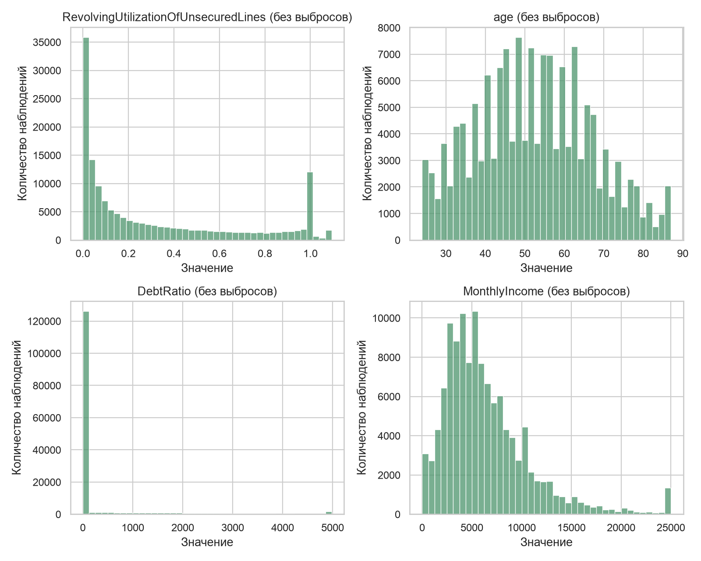

## 4. Генерация признаков

| feature                     | description                                                           |
|:----------------------------|:----------------------------------------------------------------------|
| has_missing_income          | Индикатор отсутствия MonthlyIncome до импутации.                      |
| has_missing_dependents      | Индикатор отсутствия NumberOfDependents до импутации.                 |
| income_per_dependent        | Доход на одного иждивенца с защитой от деления на ноль.               |
| debt_per_income             | Прокси денежной долговой нагрузки: DebtRatio * MonthlyIncome.         |
| utilization_per_credit_line | Утилизация незалоговых линий на одну открытую кредитную линию.        |
| real_estate_share           | Доля ипотечных/real estate линий среди всех открытых кредитных линий. |
| total_past_due_events       | Сумма всех событий просрочки по трем окнам delinquency.               |
| weighted_past_due_score     | Взвешенный скор просрочек: 30-59, 60-89 и 90+ дней с ростом штрафа.   |
| any_past_due                | Бинарный признак наличия хотя бы одной просрочки.                     |
| severe_past_due             | Бинарный признак наличия хотя бы одной просрочки 90+ дней.            |
| past_due_per_open_line      | Интенсивность просрочек относительно числа открытых линий.            |
| utilization_times_debt      | Нелинейное взаимодействие utilization и debt ratio.                   |
| is_senior                   | Индикатор клиента 60+.                                                |
| is_young                    | Индикатор молодого клиента 30-.                                       |

### Заполнение пропусков

- `MonthlyIncome` заполняется медианой внутри возрастного бина, затем глобальной медианой как резервным вариантом.
- `NumberOfDependents` заполняется по той же схеме: медиана возрастного бина, затем глобальная медиана.
- Для обеих колонок сохраняются индикаторы пропуска (`has_missing_income`, `has_missing_dependents`), чтобы модель могла использовать сам факт отсутствия значения.

## 5. Обучение модели

- Модель: `LightGBM`
- Cross-validation: `5-fold StratifiedKFold`
- Hyperparameter tuning: `Optuna`, trials = `5`
- Train/dev период: первые `120000` строк
- OOT период: последние `30000` строк

### Лучшие гиперпараметры

| parameter         |    value |
|:------------------|---------:|
| colsample_bytree  |   0.865  |
| learning_rate     |   0.0382 |
| max_depth         |   3      |
| min_child_samples |  38      |
| min_child_weight  |   0.0398 |
| n_estimators      | 273      |
| num_leaves        | 118      |
| reg_alpha         |   0.0007 |
| reg_lambda        |   0.1538 |
| subsample         |   0.7035 |

Лучшее среднее `CV ROC-AUC`: `0.8647`

### Метрики cross-validation на development

|   fold |   roc_auc |   pr_auc |     ks |
|-------:|----------:|---------:|-------:|
|      1 |    0.871  |   0.4208 | 0.5972 |
|      2 |    0.8681 |   0.3911 | 0.5767 |
|      3 |    0.8649 |   0.4006 | 0.5743 |
|      4 |    0.8555 |   0.366  | 0.5533 |
|      5 |    0.8638 |   0.408  | 0.5752 |

### Финальные метрики

| sample      |   roc_auc |   pr_auc |     ks |   precision_at_0_5 |   recall_at_0_5 |
|:------------|----------:|---------:|-------:|-------------------:|----------------:|
| development |    0.8718 |   0.4114 | 0.5864 |             0.2137 |          0.793  |
| oot         |    0.872  |   0.4189 | 0.5857 |             0.2206 |          0.7891 |

### Кривые качества

График `CV ROC-AUC` показывает стабильность качества модели между фолдами на development. Чем меньше разброс между фолдами, тем устойчивее модель к изменению обучающей выборки.

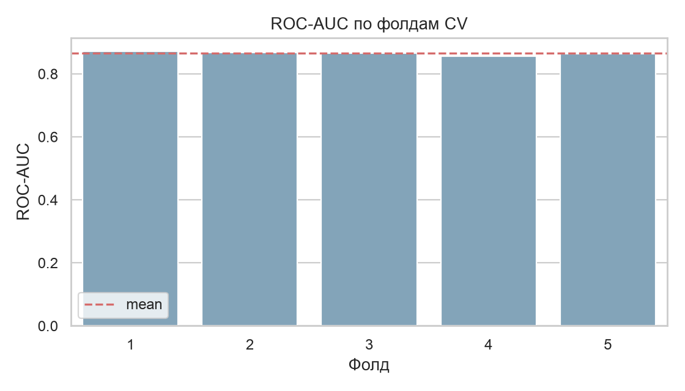

График распределения скорингов на `OOT` показывает, насколько хорошо модель разделяет клиентов с дефолтом и без дефолта на отложенной выборке. Чем сильнее разнесены распределения, тем лучше разделяющая способность модели.

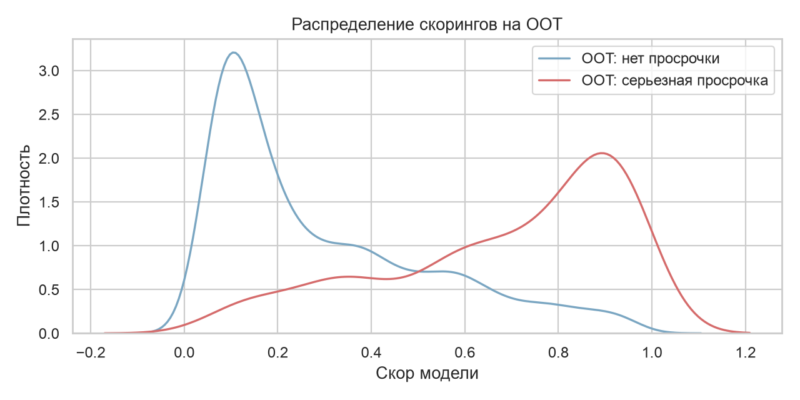

ROC-кривая на `OOT` показывает компромисс между полнотой и ложноположительными срабатываниями при переборе порога. Чем ближе кривая к левому верхнему углу, тем лучше модель разделяет классы.

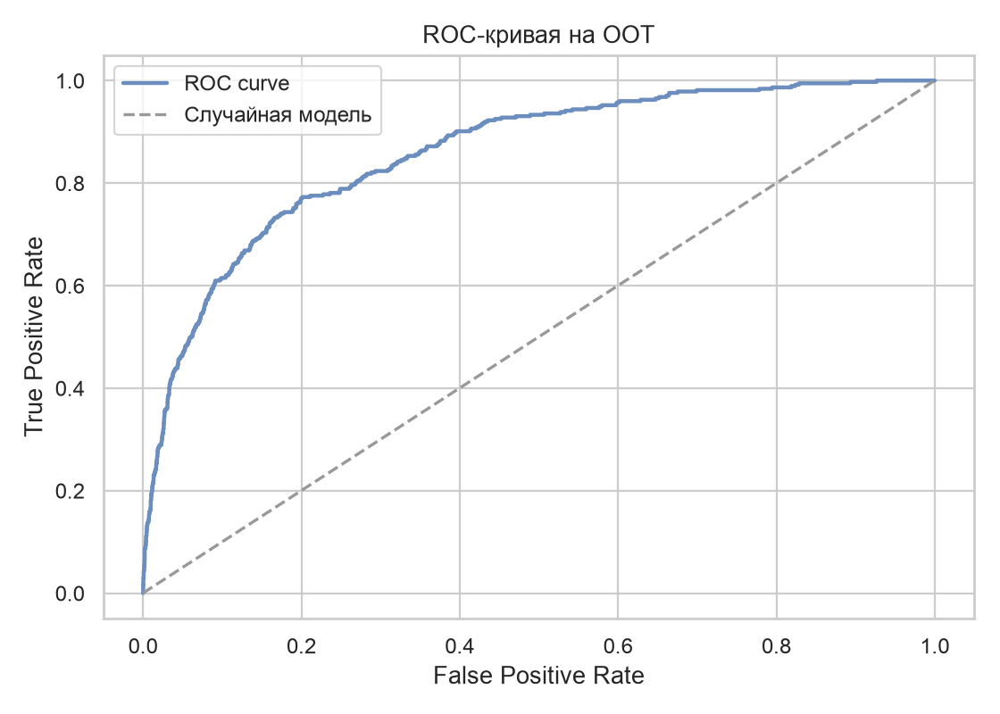

## 6. Интерпретация модели

### Важность признаков

Диаграмма важности признаков показывает, какие признаки сильнее всего влияют на обучение модели в терминах встроенной важности `LightGBM`. Это быстрый способ понять, на какие группы факторов модель опирается в первую очередь.

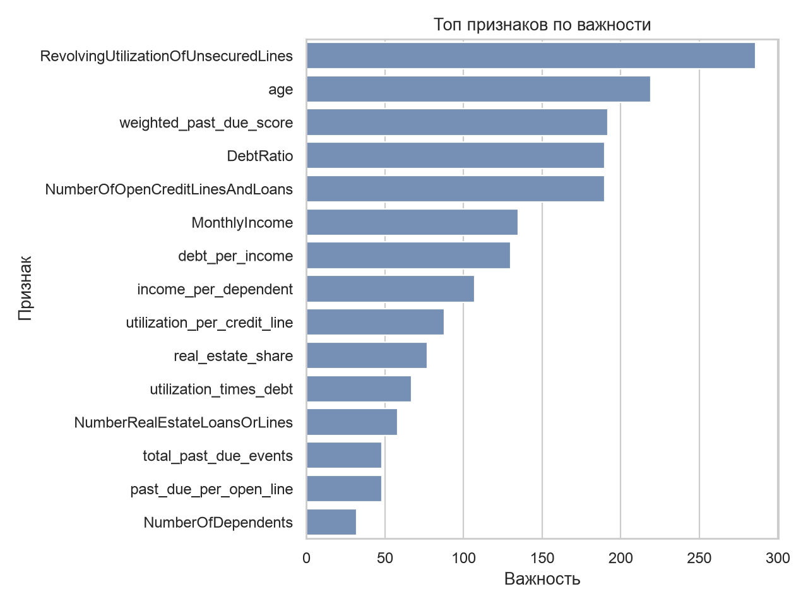

### SHAP-анализ

| feature                              |   mean_abs_shap |
|:-------------------------------------|----------------:|
| RevolvingUtilizationOfUnsecuredLines |          0.606  |
| total_past_due_events                |          0.4027 |
| age                                  |          0.2308 |
| weighted_past_due_score              |          0.2282 |
| NumberOfOpenCreditLinesAndLoans      |          0.2221 |
| MonthlyIncome                        |          0.0835 |
| DebtRatio                            |          0.0825 |
| NumberRealEstateLoansOrLines         |          0.0604 |
| income_per_dependent                 |          0.0595 |
| past_due_per_open_line               |          0.0475 |
| real_estate_share                    |          0.0471 |
| debt_per_income                      |          0.0405 |
| utilization_per_credit_line          |          0.0212 |
| has_missing_income                   |          0.0163 |
| utilization_times_debt               |          0.0085 |

График `SHAP summary` показывает направление и силу влияния признаков на предсказания по множеству наблюдений. Он помогает понять не только важность признака, но и то, какие значения признака двигают скор вверх или вниз.

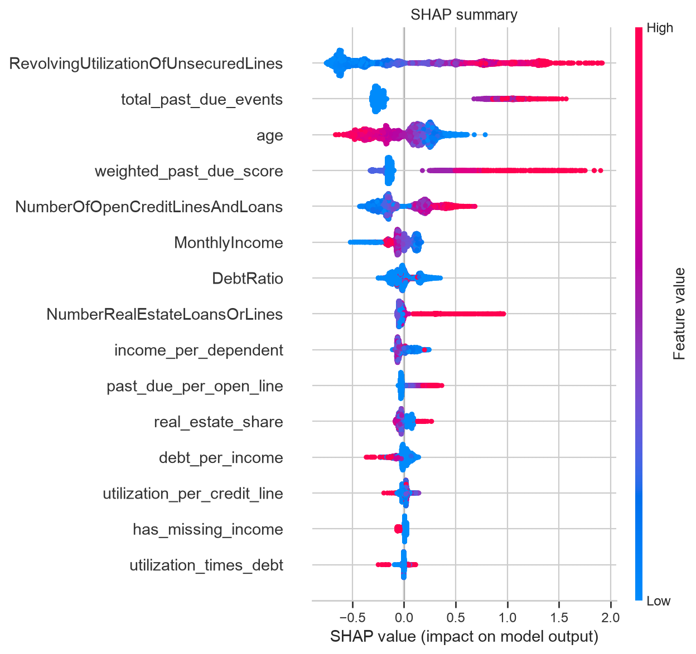

## 7. Разбор ошибок модели

### Наблюдение 1

ID `120357`: фактический класс `0`, прогноз `1`, score `0.9776`. Ключевые факторы в сторону дефолта: `weighted_past_due_score` (1.426), `RevolvingUtilizationOfUnsecuredLines` (1.262), `total_past_due_events` (1.136). Факторы против дефолта: `NumberOfOpenCreditLinesAndLoans` (-0.107), `income_per_dependent` (-0.047), `NumberRealEstateLoansOrLines` (-0.026). Интерпретация: модель увидела сильный риск по паттерну просрочек/нагрузки, но фактического дефолта не произошло; это похоже на консервативную переоценку риска.

### Наблюдение 2

ID `127373`: фактический класс `1`, прогноз `0`, score `0.0471`. Ключевые факторы в сторону дефолта: `real_estate_share` (0.056), `has_missing_income` (0.023), `utilization_per_credit_line` (0.013). Факторы против дефолта: `age` (-0.539), `RevolvingUtilizationOfUnsecuredLines` (-0.428), `NumberOfOpenCreditLinesAndLoans` (-0.305). Интерпретация: по наблюдаемым признакам клиент выглядел относительно стабильным, однако дефолт произошел; вероятно, в данных не хватает внешних факторов риска.

## 8. Выводы

Модель демонстрирует устойчивое разделение классов на development и сохраняет качество на псевдо-OOT. При этом интерпретация ограничена отсутствием реальной временной оси в исходном датасете, поэтому для production-валидации стоит повторить анализ на данных с настоящей датой наблюдения.